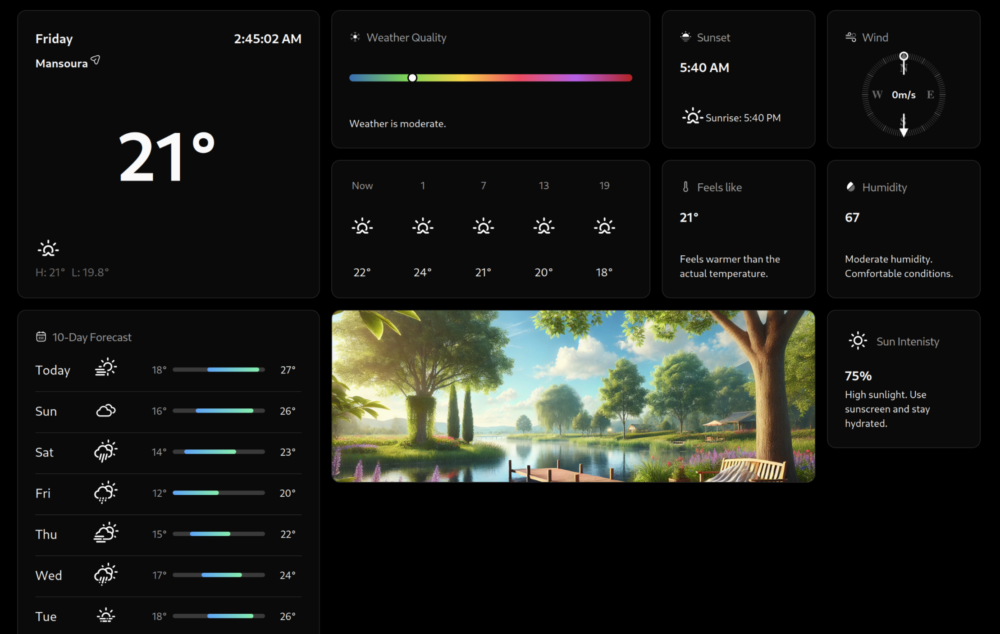

# SkySnap
Full Blown Mini Weather Station using ESP32 & Nextjs

Hardware code: [SkySnap_ESP](https://github.com/Justxd22/SkySnap_ESP)

# Live
 - [skysnap-eosin.vercel.app](https://skysnap-eosin.vercel.app) 

## criedts
- Full credits to [DariusLukasukas](https://github.com/DariusLukasukas/nextjs-weather-app) for the nextjs code base